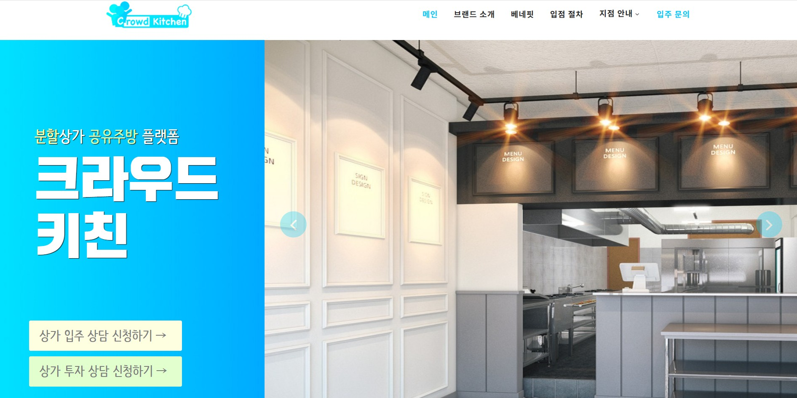
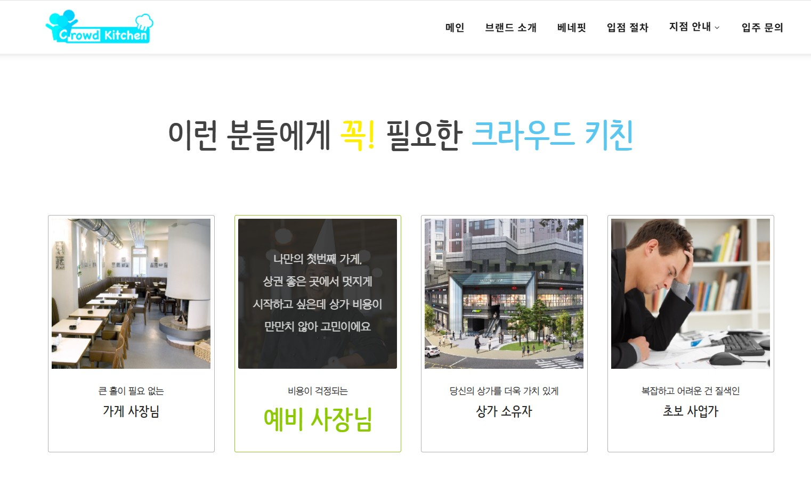
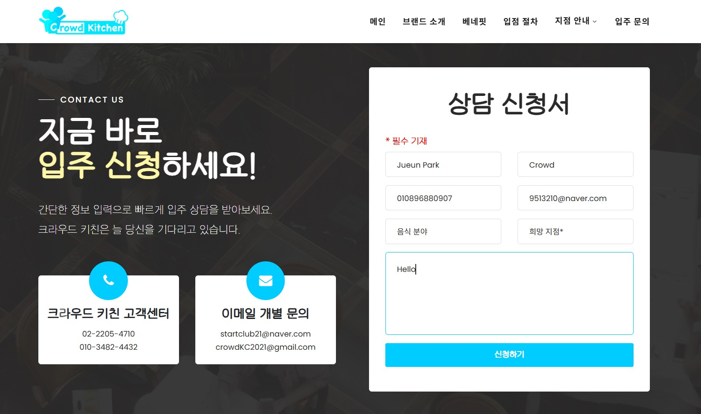
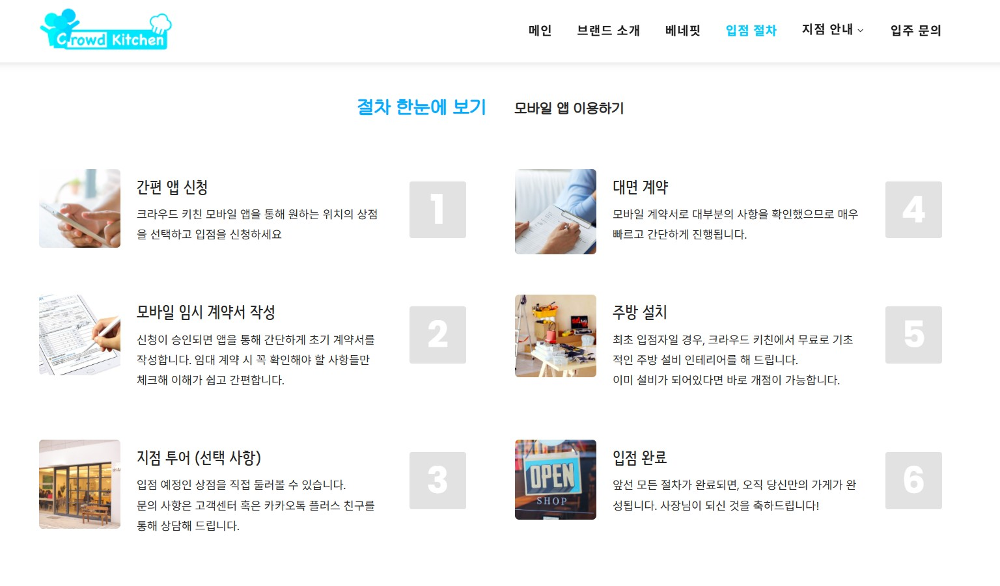

Markdown
#  Crowd Kitchen

Business planning and web prototype for a micro-divided cloud kitchen platform.

---

##  ✨Project Overview

- This project was developed as part of an entrepreneurship course.
- The goal was to propose a cloud kitchen platform that lowers startup costs for food entrepreneurs by utilizing small divided commercial spaces.
- A web prototype was created to visualize the service concept during the final presentation.

---

## 📌 Key Features
- **Business Model Planning**
- **Market research** 
- **User flow design**
- **Web prototype**
- **Startup cost analysis**
---

## 🛠️ Tech Stack
- **HTML** 
- **CSS**
- **JavaScript**

---

##  ✌️ My Role

- Proposed the original business idea
- Conducted market research and competitor analysis
- Designed the service concept and user flow
- Customized a web prototype for the final presentation

---

## 📸 Screenshots

| [ Hero Section ] | [ About ] | [ Benefits ] | 
| :---: | :---: | :---: |
|  |  |  |

| [ Benefits2 ] | [ Form ] | [ Process ] | 
| :---: | :---: | :---: |
|  |  |  |

---

## 📽️ Demo Video
https://github.com/user-attachments/assets/2bb34dc7-9e12-44a3-8f83-4c4e90cd5275

